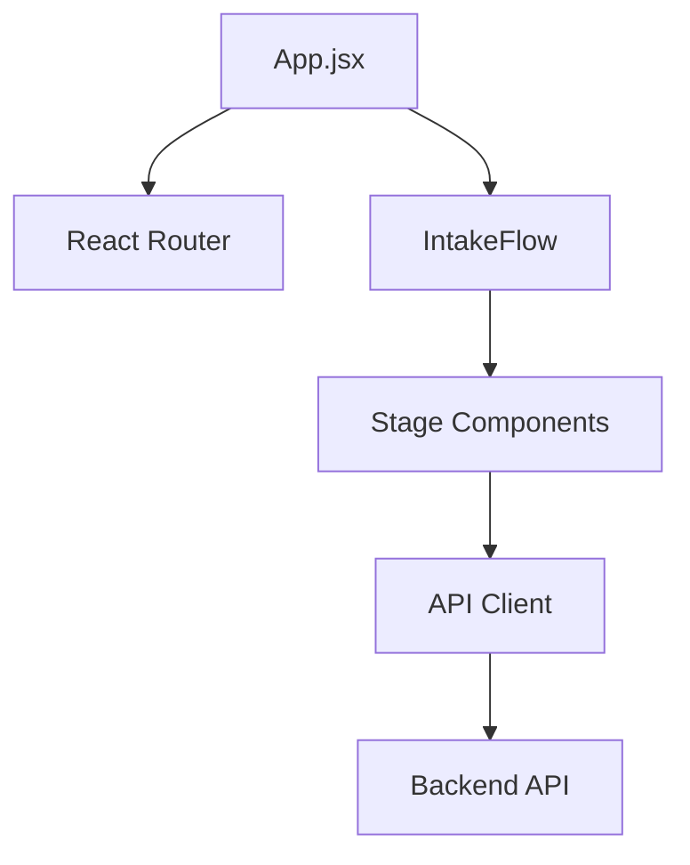
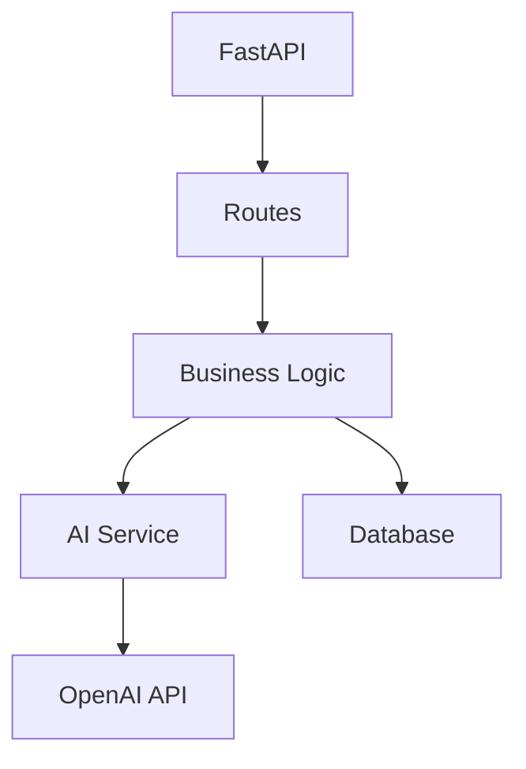

# System Architecture

## Overview
The Clinical Trials Expert User Copilot is a full-stack application with a React frontend and FastAPI backend. The system follows a modular architecture with clear separation of concerns.

## Frontend Architecture

### Component Hierarchy
```
App
└── IntakeFlow
    ├── StageOneIntake
    ├── StageTwo5Ws
    └── StageThreeSynopsis
```

### State Management
- Uses React's useState and useContext hooks
- State flow:
  - `stage`: Controls current form stage (1-3)
  - `copilotData`: Stores form data across stages
  - `feedback`: Tracks user feedback entries

### Data Flow
1. User input → Component state
2. Component state → Parent state (IntakeFlow)
3. Parent state → Backend API
4. Backend response → UI updates

## Backend Architecture

### API Structure
```
/copilot/
├── /intake
│   ├── POST /submit
│   └── GET /status
├── /analysis
│   ├── POST /analyze
│   └── GET /results
└── /feedback
    └── POST /submit
```

### Data Models
- Trial Intake Data
- Analysis Results
- User Feedback
- System Configuration

### Service Layer
1. Request Validation (Pydantic)
2. Business Logic
3. AI Processing
4. Data Persistence

## Dependencies and Data Flow

### Frontend Dependencies


### Backend Dependencies


## API Contracts

### Request/Response Patterns

#### Trial Intake
```typescript
interface IntakeData {
  stage: number;
  data: {
    trialName: string;
    description: string;
    // ... other fields
  };
}

interface IntakeResponse {
  success: boolean;
  message: string;
  nextStage?: number;
}
```

#### Analysis
```typescript
interface AnalysisRequest {
  trialData: IntakeData;
  analysisType: string;
}

interface AnalysisResponse {
  results: {
    summary: string;
    recommendations: string[];
    risks: string[];
  };
  confidence: number;
}
```

## Error Handling

### Frontend
- Form validation errors
- API error responses
- Network failures
- State management errors

### Backend
- Input validation
- Database errors
- AI service failures
- Rate limiting

## Security Considerations

1. API Authentication (TODO)
2. Input Sanitization
3. CORS Configuration
4. Rate Limiting
5. Data Encryption

## Performance Optimization

1. Frontend
   - Component lazy loading
   - State management optimization
   - API response caching

2. Backend
   - Database query optimization
   - AI service caching
   - Async processing

## Monitoring and Logging

### Frontend
- User interaction tracking
- Error logging
- Performance metrics

### Backend
- API request logging
- Error tracking
- System metrics

## Future Considerations

1. Scalability
   - Microservices architecture
   - Load balancing
   - Database sharding

2. Features
   - Real-time collaboration
   - Advanced analytics
   - Machine learning improvements

3. Integration
   - External API integrations
   - Third-party services
   - Data export/import 